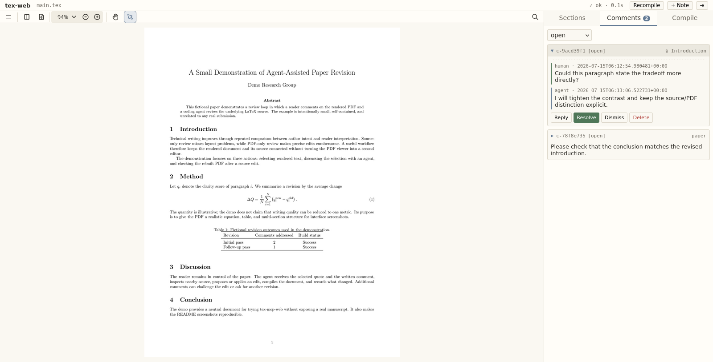

# tex-mcp-web

Review a LaTeX paper from its rendered PDF while Claude Code or Codex edits the source.



You read the PDF in a browser and leave comments on selected text, sections, or the whole paper. The coding agent reads those comments through MCP, edits the LaTeX source, compiles it, and records its response. The rebuilt PDF appears in the same browser.

## Install

tex-mcp-web requires Python 3.10 or newer and a supported document compiler on `PATH`. LaTeX projects use `latexmk` by default; `pdflatex`, `xelatex`, `lualatex`, and `pandoc` are also supported.

```bash
pip install "tex-mcp-web[mcp] @ git+https://github.com/MiiKiyoshi/tex-mcp-web"
```

## Connect Claude Code or Codex

Register tex-mcp-web once for the agent you use.

Claude Code:

```bash
claude mcp add --scope user tex-mcp -- tex-mcp
```

Codex:

```bash
codex mcp add tex-mcp -- tex-mcp
```

`tex-mcp` is the process that the agent starts for the MCP connection. You do not run it separately after registration.

## Set up a paper

Each paper needs a `.tex-mcp-web.yaml` in its project root. This file identifies the paper, tells the web server what to compile and watch, and lets the MCP process find the same project when the agent is working in a subdirectory.

Without this file, `tex-web` falls back to `main.tex` on port `8765` in the current directory. That fallback does not mark the project root or assign a per-paper port, so the normal MCP workflow uses `.tex-mcp-web.yaml`.

Enter the paper directory and create the file if it does not already exist:

```bash
cd my-paper
tex-mcp-web init --main main.tex
```

`--main` is the path to the top-level source file, relative to the project root. `init` refuses to overwrite an existing `.tex-mcp-web.yaml`.

The generated file contains:

```yaml
main: main.tex
watch:
- '*.tex'
- '*.bib'
- '*.md'
- '*.txt'
ignore:
- '*_backup.tex'
compiler: auto
port: 8765
```

| Field | Effect |
|---|---|
| `main` | Top-level source file compiled into the PDF. |
| `watch` | File patterns that trigger recompilation after a change. Patterns are matched against filenames and project-relative paths. |
| `ignore` | Paths checked before `watch`. A matching change does not trigger recompilation. |
| `compiler` | `auto` uses `latexmk` for LaTeX and `pandoc` for Markdown or text. It can also name a supported compiler explicitly. |
| `port` | Browser and MCP daemon port for this paper. |

Inspect the settings, then start the web server:

```bash
tex-mcp-web config
tex-web
```

Open the address printed by `tex-web`, such as [http://localhost:8765](http://localhost:8765). Keep this process running while reviewing the paper. Start Claude Code or Codex from the paper directory or one of its subdirectories.

### Serve multiple papers

Every paper running at the same time needs a different port. Set each port before starting `tex-web` and the corresponding agent session:

```bash
cd paper-a
tex-mcp-web config port 8765
tex-web
```

In another terminal:

```bash
cd paper-b
tex-mcp-web config port 8766
tex-web
```

The papers are then available at `http://localhost:8765` and `http://localhost:8766`. If you change a port after starting the processes, restart `tex-web` and the agent session so both use the new value.

## Review with the agent

Select text in the PDF and write a comment. The comment dialog can also carry an exact replacement. Use **+ Note** for a paper-level comment or the **Sections** tab for a section-level comment.

Click a numbered citation such as `[3]` to preview its bibliography entry as selectable text. Click the preview to select the entry for copying, or click elsewhere to close it.

Then ask the agent:

> Process the open tex-mcp-web comments.

The agent reads the open comments and nearby source, makes the requested edits, compiles the paper, verifies the result, and only then replies to or resolves each comment. You can inspect the rebuilt PDF, reply in the same thread, or add another comment.

Other useful requests include:

> Read my replies and continue the revision.

> Review the Methods section and add comments without editing the paper.

The web interface also provides **Reply**, **Resolve**, and **Dismiss** actions. `j` and `k` move between comments, `r` opens a reply, `R` opens resolve, `d` opens dismiss, `Esc` cancels the current action, and `\` collapses the sidebar. `Ctrl`/`Cmd` + wheel zooms around the pointer.

## Read and change project settings

`tex-mcp-web config` reads and edits the nearest `.tex-mcp-web.yaml` found in the current directory or its parents.

```bash
tex-mcp-web config                    # print the file and all settings
tex-mcp-web config port               # print one value
tex-mcp-web config port 8766          # change one value
```

The editable keys and value formats are:

```bash
tex-mcp-web config main paper.tex
tex-mcp-web config port 8766
tex-mcp-web config compiler xelatex
tex-mcp-web config watch 'main.tex,sections/**,*.bib'
tex-mcp-web config ignore '*_backup.tex,old/**'
```

`watch` and `ignore` accept comma-separated patterns. Supported compiler values are `auto`, `latexmk`, `pdflatex`, `xelatex`, `lualatex`, and `pandoc`.

### Choose what triggers recompilation

Watcher paths are relative to the directory containing `.tex-mcp-web.yaml`. A filename pattern such as `*.tex` matches that filename extension at any depth. A path pattern such as `private/**` matches only that project directory and its contents. `ignore` is checked before `watch`, so an ignored path never triggers automatic recompilation even when it also matches `watch`.

For a paper that watches its LaTeX and bibliography files but ignores the entire `private/` directory:

```yaml
watch:
- '*.tex'
- '*.bib'
ignore:
- 'private/**'
- '*_backup.tex'
```

This excludes both `private/note.tex` and nested paths such as `private/experiments/result.tex`. The same setting can be written from the shell:

```bash
tex-mcp-web config ignore 'private/**,*_backup.tex'
```

`ignore` controls only whether a file change triggers automatic recompilation. It does not prevent LaTeX from reading an `\input` file, prevent the agent from opening the directory, or exclude files from Git. Repository privacy still belongs in `.gitignore`.

## Other commands

`tex-mcp-web compile` performs one compilation without starting the web server and reports errors and warnings. Add `--json` for structured output.

`tex-mcp-web goto TARGET` moves a running viewer. A target can be a section title, a page such as `p2`, a line number, or a source location such as `tex/intro.tex:47`.

Running `tex-mcp-web` without a subcommand starts the same web server as `tex-web`.

## Try the included demo

The repository includes a fictional one-page paper that is unrelated to any real manuscript:

```bash
cd examples/demo-paper
tex-web
```

Open [http://localhost:8876](http://localhost:8876). The demo starts with an empty comment queue. Its source is [`examples/demo-paper/main.tex`](examples/demo-paper/main.tex), and its project settings are [`examples/demo-paper/.tex-mcp-web.yaml`](examples/demo-paper/.tex-mcp-web.yaml).

## Project files and privacy

`.tex-mcp-web.yaml` contains the project settings. Review conversations are stored in `.tex-mcp-web/comments.json` beside the paper. That file can contain selected manuscript text and discussion, so decide whether to track or ignore it according to the paper's privacy requirements.

## Troubleshooting

If the browser opens without a PDF, run `tex-mcp-web config main` and confirm that it names the correct top-level source file. Then inspect the **Compile** tab or run `tex-mcp-web compile` in the paper directory.

If a port is already in use, choose an unused value with `tex-mcp-web config port PORT`, then restart `tex-web` and the agent session.

If the agent opens the wrong paper, run `tex-mcp-web config` from its working directory. The first output line shows which `.tex-mcp-web.yaml` was found. The agent must run inside that project root or one of its subdirectories.

If agent-triggered compilation or viewer navigation cannot reach the daemon, confirm that `tex-web` is running for the same project and port.

tex-mcp-web is a hard fork of [queelius/scholia](https://github.com/queelius/scholia) v0.6.1 and is independently developed under the MIT license. See [`LICENSE`](LICENSE).
