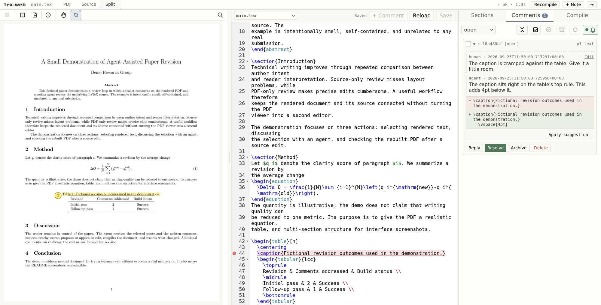

# tex-mcp-web

Review a LaTeX paper from its rendered PDF while Claude Code or Codex edits the source.

If it helps your writing, a star is very welcome.



You read the PDF in a browser and comment on selected PDF text, selected source text, a section, or the whole paper. The agent reads those comments over MCP, edits the LaTeX, compiles once after the batch, and replies in the same thread.

Use the topbar's **PDF**, **Source**, and **Split** tabs to review the rendered paper, make a small source edit, or see both together. Drag the handle between the panes to adjust their sizes. Select source text and press **+ Comment** to highlight exactly those characters, including text that wraps onto another display line. Source files follow the configured `watch` and `ignore` rules. Saving is explicit, and the editor refuses to overwrite a file changed by an agent or another editor after it was opened.

```
you:    select text -> write a comment -> press Call agent
                  |
agent:  read comments -> edit LaTeX -> compile -> reply
                  |
you:    read the rebuilt PDF -> comment again
```

## Install

Python 3.10 or newer and a compiler on `PATH` (`latexmk` for LaTeX by default; `pdflatex`, `xelatex`, `lualatex`, and `pandoc` are also supported).

```bash
pip install "tex-mcp-web[mcp] @ git+https://github.com/MiiKiyoshi/tex-mcp-web"
```

## Connect Claude Code or Codex

Register the MCP server once for the agent you use.

Claude Code:

```bash
claude mcp add --scope user tex-mcp -- tex-mcp
```

Codex:

```bash
codex mcp add tex-mcp -- tex-mcp
```

The agent starts `tex-mcp` itself; you do not run it separately. It also serves the review page for the project it starts in, so a paper needs no second process.

## Set up a paper

Each paper needs a `.tex-mcp-web.yaml` at its root. Create it once in the paper directory:

```bash
cd my-paper
tex-mcp-web init --main main.tex
```

`--main` is the top-level source file that produces the PDF. `init` will not overwrite an existing file. It writes:

```yaml
main: main.tex
watch:
- '*.tex'
- '*.bib'
- '*.md'
- '*.txt'
ignore:
- '*_backup.tex'
compiler: auto
auto_compile: false
port: 8765
```

| Field | Effect |
|---|---|
| `main` | Top-level source file compiled into the PDF. |
| `dir` | Folder holding the paper, relative to this file or absolute. Unset means the folder holding this file. |
| `watch` | File patterns that trigger recompilation on save. Only the directories the paper's sources live in are watched: those of `main` and the files it `\input`s, plus the directories of every project-local source the last latexmk run recorded (figures, `.bib`); the paper folder itself is watched flat. |
| `ignore` | Patterns checked before `watch`; a match does not recompile. |
| `compiler` | `auto` (latexmk for LaTeX, pandoc for Markdown or text) or a named compiler. |
| `auto_compile` | `true` recompiles on watched saves; `false` leaves it to the topbar button or the agent. |
| `port` | The local port for this paper's review page and MCP server. |

To keep the paper out of the folder you start the agent in, put the config there and point `dir` at the paper:

```bash
cd my-project
tex-mcp-web init --main main.tex
tex-mcp-web config dir ../my-paper
```

The source, the PDF, and the comment store then stay under `../my-paper`; the project folder holds only the config file.

Start Claude Code or Codex from the paper directory (or a subdirectory), then tell the agent:

> Open the review page and listen for **Call agent**.

The agent opens the review page at the configured port and starts listening.

## Use it

Drag over PDF text and write a comment; add a suggested wording in the replacement box when you have one. Use **+ Note** for a whole-paper comment and the **Sections** tab for a section comment. Press **Call agent** when the comments are ready.

The agent reads them, edits the source, compiles, and replies in each thread. Resolving is yours: pick the threads whose edit satisfies you and resolve them from the page, or reopen one the agent got wrong. If an edit misses, reply in the same thread. **Reference** sets a thread aside to read again: it stays out of the open and resolved lists, still takes replies, and goes back to either with **Reopen** or **Resolve**.

If the agent restarts or stops receiving calls, ask it to listen for **Call agent** again. Calls made while it is disconnected stay queued.

## Several papers at once

Give each paper its own port, then start an agent session in each directory:

```bash
cd paper-a && tex-mcp-web config port 8765
cd paper-b && tex-mcp-web config port 8766
```

They open at `http://localhost:8765` and `http://localhost:8766`. A port already serving another paper is an error, not shared; after changing a port, restart that paper's agent session.

## Configuration

`tex-mcp-web config` finds the nearest `.tex-mcp-web.yaml` from the current directory upward.

```bash
tex-mcp-web config                 # print the whole config
tex-mcp-web config port            # print one field
tex-mcp-web config port 8766       # change one field
tex-mcp-web config compiler xelatex
tex-mcp-web config watch 'main.tex,sections/**,*.bib'
```

Comma-separated patterns set `watch` and `ignore`.

## More commands

```bash
tex-mcp-web compile          # compile once, without the review page
tex-mcp-web compile --json   # errors and warnings as JSON
tex-mcp-web goto Methods     # move a running viewer to a section, page (p2), or tex/intro.tex:47
```

## Acknowledgements

tex-mcp-web is a hard fork of [queelius/scholia at commit `e6c7454`](https://github.com/queelius/scholia/commit/e6c745400d2ad70fb43eca053e31183d48765f89) (version 0.6.1), independently developed since under the MIT license; see [`LICENSE`](LICENSE). PDF viewing uses [EmbedPDF](https://github.com/embedpdf/embed-pdf-viewer) and its PDFium WebAssembly engine, whose notices are in [`tex_mcp_web/static/embedpdf/LICENSE`](tex_mcp_web/static/embedpdf/LICENSE) and [`tex_mcp_web/static/embedpdf/LICENSE.pdfium`](tex_mcp_web/static/embedpdf/LICENSE.pdfium). Source highlighting uses [Ace Editor builds 1.44.0](https://github.com/ajaxorg/ace-builds/tree/v1.44.0) under the BSD-3-Clause license; its notice is in [`tex_mcp_web/static/ace/LICENSE`](tex_mcp_web/static/ace/LICENSE).
