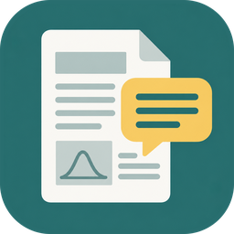
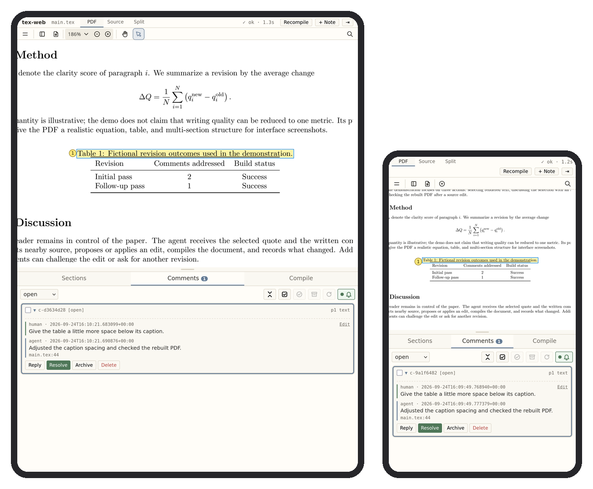

# tex-mcp-web

Review a LaTeX paper from its rendered PDF, on a desktop, tablet, or phone, while Claude Code or Codex edits the source.

If it helps your writing, a star is very welcome.


You comment on the PDF in your browser. The agent reads the comments, edits the LaTeX,
compiles, and replies in the same thread.

```
you:    select text -> write a comment -> press Call agent
                  |
agent:  read comments -> edit LaTeX -> compile -> reply
                  |
you:    read the rebuilt PDF -> comment again
```

## Install

Paste this into Claude Code or Codex:

```
Install tex-mcp-web by following https://raw.githubusercontent.com/MiiKiyoshi/tex-mcp-web/main/INSTALL.md
```

The agent checks for Python and LaTeX, shows you what it will install, and registers
tex-mcp-web for every folder once you agree. Start the agent again afterwards.

## Init

Once per paper, start the agent in the paper's folder and say:

```
do tex init
```

The agent finds the main `.tex` file and a free port, shows you the settings, and writes
`.tex-mcp-web.yaml` once you agree.

## Listen

To review, say:

```
do tex listen
```

Open `http://localhost:<port>` with the port you chose at init. Say it again after the
agent restarts. Presses of **Call agent** made meanwhile wait for it.

## On a tablet or phone

The review page adapts to the screen: on a tablet or phone the comments dock below the PDF,
and the border between them drags with a finger. Review on a tablet while the agent works
on the desktop.



The server listens on `127.0.0.1` only, so reach it from another device through a
forwarded port: an SSH tunnel, VS Code port forwarding, or `tailscale serve`.

## Reviewing

- **PDF**, **Source**, and **Split** show the paper, its source, or both. Drag the
  handle between them to resize.
- Drag over PDF text, or select source text and press **+ Comment**, then write what should
  change. Add a suggested wording in the replacement box when you have one.
- **+ Note** comments on the whole paper, and the **Sections** tab comments on a section.
- Press **Call agent** when your comments are ready. **Recompile** rebuilds the PDF yourself.
- The agent may answer with a proposed rewrite. **Apply suggestion** is what writes it into
  the source.
- Resolving is yours: **Resolve** a thread whose edit satisfies you, or reply in it when it
  does not. **Archive** sets a thread aside, and it still takes replies.
- Saving in the Source view is explicit and refuses to overwrite a file changed by someone
  else after you opened it.

## Configuration

`.tex-mcp-web.yaml` sits at the paper's root. Ask the agent to change a field, or edit it.

| Field | Effect |
|---|---|
| `main` | Top-level source file compiled into the PDF. |
| `dir` | Folder holding the paper, relative to this file or absolute. Unset means this file's folder. |
| `watch` | Source files the page offers and follows, `*.tex` and `*.bib` by default. |
| `ignore` | Patterns checked before `watch`. |
| `compiler` | `auto` (latexmk for LaTeX, pandoc for Markdown or text) or a named compiler. |
| `port` | This paper's review page port. Each paper needs its own. |

## Commands

```bash
tex-mcp-web compile          # compile once, without the review page
tex-mcp-web compile --json   # errors and warnings as JSON
tex-mcp-web goto Methods     # move a running viewer to a section, page (p2), or tex/intro.tex:47
```

## Acknowledgements

tex-mcp-web is a hard fork of [queelius/scholia at commit `e6c7454`](https://github.com/queelius/scholia/commit/e6c745400d2ad70fb43eca053e31183d48765f89) (version 0.6.1), independently developed since under the MIT license. See [`LICENSE`](LICENSE). PDF viewing uses [EmbedPDF](https://github.com/embedpdf/embed-pdf-viewer) and its PDFium WebAssembly engine, whose notices are in [`tex_mcp_web/static/embedpdf/LICENSE`](tex_mcp_web/static/embedpdf/LICENSE) and [`tex_mcp_web/static/embedpdf/LICENSE.pdfium`](tex_mcp_web/static/embedpdf/LICENSE.pdfium). Source highlighting uses [Ace Editor builds 1.44.0](https://github.com/ajaxorg/ace-builds/tree/v1.44.0) under the BSD-3-Clause license, and its notice is in [`tex_mcp_web/static/ace/LICENSE`](tex_mcp_web/static/ace/LICENSE).
