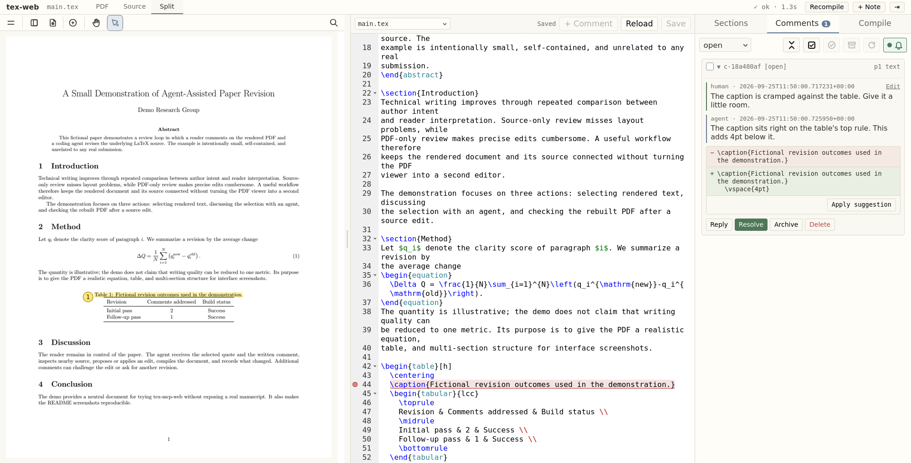
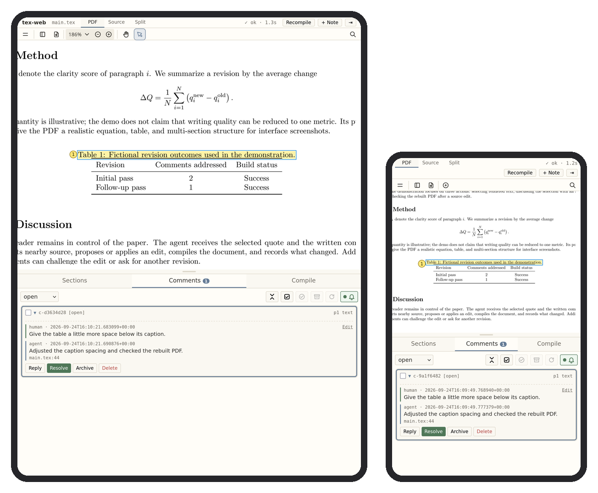

# tex-mcp-web

Review a LaTeX paper from its rendered PDF, on a desktop, tablet, or phone, while Claude Code or Codex edits the source.

> ⭐ **If this helps your writing, please give it a star.** It helps others find the project.



## Install

Paste this into Claude Code or Codex:

```
Install tex-mcp-web by following https://raw.githubusercontent.com/MiiKiyoshi/tex-mcp-web/main/INSTALL.md
```

The agent checks for Python 3.10 or newer and `latexmk`, shows where it will install and
which agents it will register with, and installs once you agree. Start the agent again
afterwards.

## Init

Once per paper, start the agent in the paper's folder and say:

```
do tex init
```

The agent finds the main `.tex` file and a free port, shows you the settings, and writes
`.tex-mcp-web.yaml` once you agree. A folder that already has one keeps it.

## Listen

To review, say:

```
do tex listen
```

Open `http://localhost:<port>` with the port you chose at init. The agent serves the page,
so there is nothing else to start. Say it again after the agent restarts.

## Reviewing

- Drag over PDF text and write what should change. Add a suggested wording in the
  replacement box when you have one.
- **+ Note** comments on the whole paper, and the **Sections** tab comments on a section.
  You can also select text in the Source tab and press **+ Comment**.
- Press **Call agent**, the bell in the Comments tab, when your comments are ready. The
  listening agent edits the source, compiles, and replies in the same thread. Without
  listen, ask the agent in chat to handle the tex comments.
- **Resolve** a thread whose edit satisfies you, or **Reply** in it when it does not.
  **Archive** sets a thread aside, and it still takes replies.
- Edits in the Source tab are saved when you press **Save**.

## Suggested edits

The thread shows the source lines the agent would change as a −/+ pair, and the Source tab
marks the same text in red. **Apply suggestion** writes the change into the file. Proposing
again replaces the proposal.

## On a tablet or phone



Forward the port you chose at init over SSH, from Termux on Android or iSH on iOS, then open
`http://localhost:<port>` in the phone's browser.

```
ssh -L <port>:localhost:<port> <server>
```

## Configuration

Edit `.tex-mcp-web.yaml` at the paper's root. A saved change applies at once, except `port`
and `dir`, which apply when Claude Code or Codex restarts.

```yaml
main: main.tex
watch:
- '*.tex'
- '*.bib'
ignore:
- '*_backup.tex'
compiler: auto
port: 8765
```

| Field | Effect |
|---|---|
| `main` | Top-level source file compiled into the PDF. |
| `dir` | Folder holding the paper, relative to this file or absolute. Unset means this file's folder. |
| `watch` | Source files the Source tab offers. |
| `ignore` | Patterns excluded even when they match `watch`. |
| `compiler` | `auto` (latexmk for LaTeX, pandoc for Markdown or text), `latexmk`, `pdflatex`, `xelatex`, `lualatex`, or `pandoc`. |
| `port` | This paper's review page port. Any free port works. Init picks the first free one from 8765, so each paper can have its own. |

## Acknowledgements

tex-mcp-web is a hard fork of [queelius/scholia at commit `e6c7454`](https://github.com/queelius/scholia/commit/e6c745400d2ad70fb43eca053e31183d48765f89) (version 0.6.1), independently developed since under the MIT license. See [`LICENSE`](LICENSE). PDF viewing uses [EmbedPDF](https://github.com/embedpdf/embed-pdf-viewer) and its PDFium WebAssembly engine, whose notices are in [`tex_mcp_web/static/embedpdf/LICENSE`](tex_mcp_web/static/embedpdf/LICENSE) and [`tex_mcp_web/static/embedpdf/LICENSE.pdfium`](tex_mcp_web/static/embedpdf/LICENSE.pdfium). Source highlighting uses [Ace Editor builds 1.44.0](https://github.com/ajaxorg/ace-builds/tree/v1.44.0) under the BSD-3-Clause license, and its notice is in [`tex_mcp_web/static/ace/LICENSE`](tex_mcp_web/static/ace/LICENSE).
